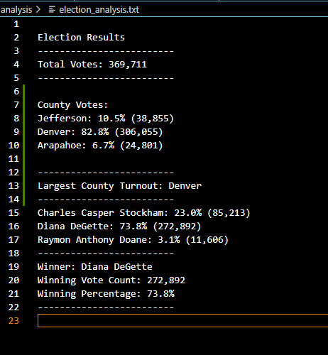
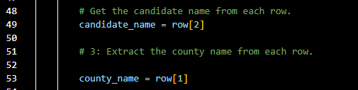

# Analysis of the Election Audit

## Overview of Election Audit

The purpose of this election audit is to review the data set further and obtain additional information for the elections commission to examine.
This includes:
    - Voters turnout for each county
    - Percentage of votes from each county out of the total count
    - County with the highest turn out

In order to review and analyze the data set, *Python* programming is used to read the csv file. 
I first began by calculating the total number of votes cast, compiling a list of the candidates and a dictionary of who received votes.
Then I determined how many votes each candidate received, and percentage of the votes each candidate won. 
The winner of the election was determined by the most popular vote.

The next step was to determine the voter turnout for each county as mentind above, and percentage of votes from each county from the total count. 
I then determined the county wth the highst turn out.

Afterwards, the following items were printed to Terminal:
    - Total votes
    - Each Candidates total votes
    - % of votes
    
The winner of the election, winning vote count, and winning % of votes were also printed to Terminal.
A *Text file* was then created to show all the results in an easy to read format. 

This type of data is useful for future elections to examine the type of voters in each county based on who they elected. 
It is also useful to find out which county has the highest turn out in voters for future campaigns, it may be beneficial to run longer campaigns in these counties. 

## Election Audit Results

The following is a list of results from the election:

    - Total number of votes: 369,711 between all counties. 
    - The counties in the election were:
        - Jefferson
        - Denver
        - Arapahoe
    - The County with the highest number of votes at 82.8% was Denver. 
    - The County with the lowest number of votes was Arapahoe at 6.7%
    - The candidates in the election were:
        - Diana DeGette
        - Charles Casper Stockham
        - Raymon Anthony Doane

    - The candidate with the highest percentage of votes, and the winner of the election, was Diana DeGette. 
    - Diana commanded a total of 272,892 votes and a winning percentage of 73.8%. 
    - The other two candidates were far below in results, and thus this was a majority win. 

***Image 1: Results of the Audit from Python Script***

## Election Audit Summary

The python script used for the election audit can be used again the following year with the same format of data in the order of "*Ballot ID, County, Candidate"*.
For example, as per the picture shown below of the highlighted lines, as long as they are on the same order the script may remain the same. 
However, if for example Candidate is listed second and County is listed third then we would adjust line 49 to show row[1] and line 53 would show row[2]. 
Saving this file would save you a whole lot of time in completing this analysis by only having to modify the code. 

Another use for this file would be to use it in another region, municipalities, provinces, states etc.
In this instance, the title of the columns would have to be adjusted based on what they refer to as the places the votes take place.
As long as the columns remain the same, but even then the data can be adjusted to fit what you are trying to find out about the election. 

